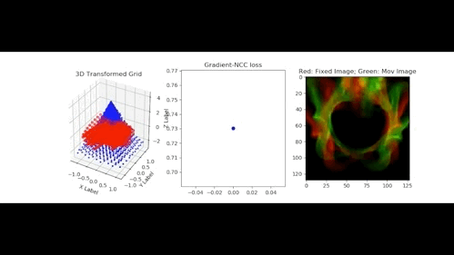
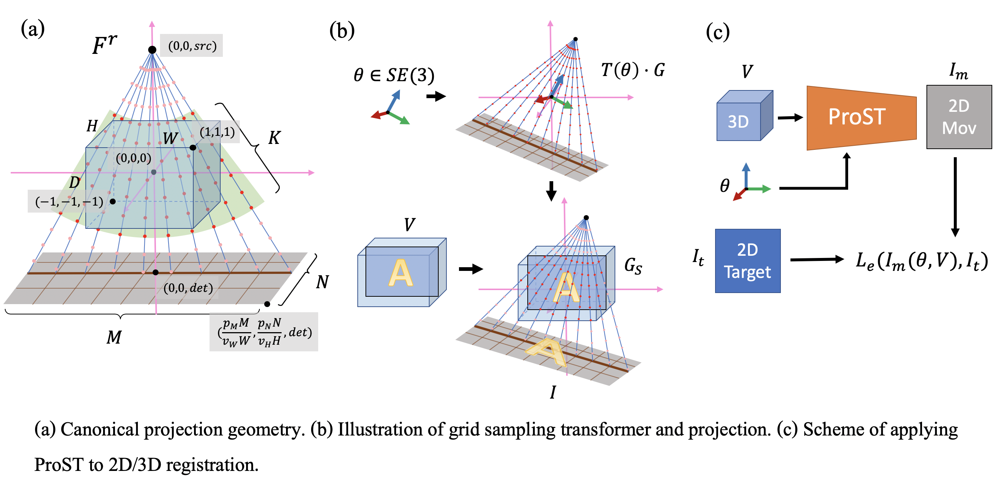
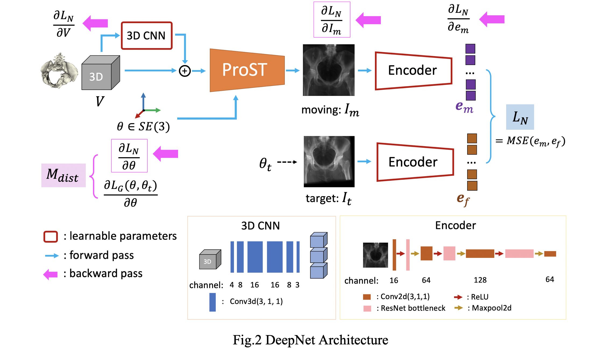

# Projective-Spatial-Transformers
[Project](http://cs.jhu.edu/~gaoc/ProST.html) | [Paper](https://link.springer.com/chapter/10.1007/978-3-030-59716-0_32) | [Video](https://www.youtube.com/watch?v=5Ypq_02Nn6U&t=287s)

Pytorch implementation of **Pro**jective **S**patial **T**ransformers (**ProST**) and training convex-shape image similarity metrics.



***Generalizing Spatial Transformers to Projective  Geometry with Applications to 2D/3D Registration.***
[Cong Gao](http://www.cs.jhu.edu/~gaoc/), [Xingtong Liu](http://www.cs.jhu.edu/~xingtongl/), [Wenhao Gu](https://www.linkedin.com/in/wenhao-gu-aa7815b0/), [Mehran Armand](https://ep.jhu.edu/about-us/faculty-directory/861-mehran-armand), [Russell Taylor](https://www.cs.jhu.edu/~rht/) and [Mathias Unberath](https://mathiasunberath.github.io/). (<a href="https://link.springer.com/chapter/10.1007/978-3-030-59716-0_32">MICCAI2020 InProceedings</a>)

We propose a novel Projective Spatial Transformer module that generalizes spatial transformers to projective geometry, thus enabling differentiable volume rendering. We demonstrate the usefulness of this architecture on the example of 2D/3D registration between radiographs and CT scans. Specifically, we show that our transformer enables end-to-end learning of an image processing and projection model that approximates an image similarity function that is convex with respect to the pose parameters, and can thus be optimized effectively using conventional gradient descent.

## Citation
If you use this code for your research, please cite our paper:
```
@InProceedings{gao2020prost,
author="Gao, Cong
and Liu, Xingtong
and Gu, Wenhao
and Killeen, Benjamin
and Armand, Mehran
and Taylor, Russell
and Unberath, Mathias",
editor="Martel, Anne L.
and Abolmaesumi, Purang
and Stoyanov, Danail
and Mateus, Diana
and Zuluaga, Maria A.
and Zhou, S. Kevin
and Racoceanu, Daniel
and Joskowicz, Leo",
title="Generalizing Spatial Transformers to Projective Geometry with Applications to 2D/3D Registration",
booktitle="Medical Image Computing and Computer Assisted Intervention -- MICCAI 2020",
year="2020",
publisher="Springer International Publishing",
address="Cham",
pages="329--339",
isbn="978-3-030-59716-0"
}
```



## Setup

### Prerequisites
- Linux or OSX (OSX has CPU support only)
- NVIDIA GPU + CUDA
- python 3.6 (recommended)

### Getting Started
- Install torch, torchvision from https://pytorch.org/. It has been tested with torch 1.7.0 and torchvision 0.8.1.
- Check requirements.txt for dependencies. You can use pip install:
```bash
pip install -r requirements.txt
```
- There is a conflice between torchgeometry package and torch tensor. Please check out the [issue](https://github.com/gaocong13/Projective-Spatial-Transformers/issues/3#issuecomment-718995585)
## ProST

### Install grid generator
We implemented our ProST grid generator function using [PyTorch C++ and CUDA extension](https://pytorch.org/tutorials/advanced/cpp_extension.html). The implementation is inspired by the [Spatial Transformer Network PyTorch C++ source code](https://github.com/pytorch/pytorch/blob/master/aten/src/ATen/native/AffineGridGenerator.cpp), but we created our own geometries and kernel functions, which is illustrated in Fig.1(a). We take the camera intrinsic parameters (usually defined by the intrinsic matrix ) as input, and generate a grid variable with shape %5Ctimes%204), where B is batch size.

The input parameters include:
- *theta*: [torch tensor] pose parameter, which is used for cloning basic properties of the grid tensor
- *size*: [torch tensor size] size of the projection image. e.g.: proj_img.size()
- *dist_min*, *dist_max*: [float] the min/max distance from source to the 8 corner points of the transformed volume, which is used to define the inner and outer radius of the green fan in Fig.1(a). This defines the grid ROI that covers the volume.
- *src*, *det*: [float] normalized source and detector z coordinates in .
- *pix_spacing*, *step_size*: [float] normalized 2D pixel spacing and sampling step size.

*src*, *det* and *pix_spacing* can be decomposed from the intrinsic matrix . We provide function *** that takes K as input

ProST grid generator is installed using python setuptools.
```bash
cd ./ProSTGrid
python setup.py install
```
The package is called ProSTGrid, which needs to be loaded after loading torch.
```bash
>> import torch
>> import ProSTGrid
```
For OSX users, we provide a CPU-only version, which can be installed without CUDA support.
```bash
cd ./ProSTGrid_cpuonly
python setup_cpuonly.py install
```
The package is called ProSTGrid_cpu, which can be loaded the same way.

### Test ProST
We provide a toy example that illustrates ProST can be used directly for 2D/3D registration.
```bash
cd ./src
python ProST_example_regi.py
```
You are expected to see a 2D/3D registration using ProST with Gradient-NCC similarity as objective function.

## Deepnet Approximating Convex Image Similarity Metrics


### Data
We uploaded an example cropped CT scan, which centers the pelvis volume, and the corresponding pelvis segmentation. They are './data/CT128.nii' and './data/CTSeg128'. We first upsample the original acquisition to be 0.5 mm isotropic voxel size, and then we crop the CT to be cubic and then downsample to 128* 128* 128 cubic volume.

### Train
Training code of our deepnet architecture is provided.
```bash
cd ./src
python train.py
```
### Registration
We upload a pretrain model and a test registration code. It is using the method of Net+GradNCC as stated in our paper.
```bash
cd ./src
python test_regi.py
```
## Contact
If you have any questions, please post through github issue, or contact cgao11@jhu.edu.
